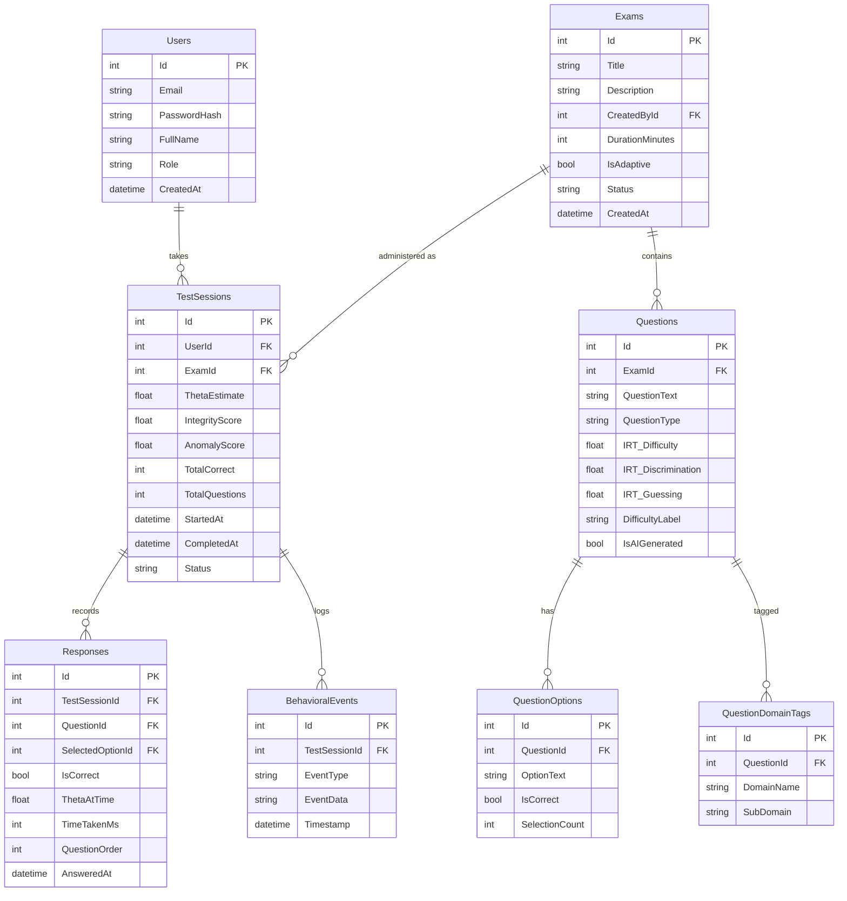

# Evalyn — Behavioral Exam Integrity & Psychometric Analysis Platform

A next-generation examination platform that combines **Item Response Theory (IRT)** adaptive testing, **ML-powered behavioral integrity scoring** (no webcam needed), **AI-assisted question generation**, and **psychometric analytics** — the same science used by GRE, GMAT, and professional certification bodies.

---

## What Makes This a "Wow" Project

1. **Adaptive Testing Engine** — Questions dynamically adjust difficulty based on real-time ability estimation (IRT 2PL model). Not a static quiz app.
2. **ML-Powered Integrity Without Surveillance** — Detect cheating through an **Isolation Forest anomaly detection model** trained on behavioral signals (typing rhythm, answer timing, tab switches, mouse entropy). No hardcoded thresholds. No invasive webcam.
3. **AI-Assisted Question Generation** — Instructors type a topic and receive 5 MCQ suggestions with auto-suggested IRT parameters, powered by the Claude API. Real generative AI, not just rules.
4. **Psychometric Dashboards** — IRT item characteristic curves, difficulty/discrimination indices, distractor analysis, cognitive skill radar charts — the analytics that Pearson/ETS uses, built from scratch.
5. **Three-Role Architecture** — Admin, Instructor, Student — each with distinct workflows and dashboards.

---

## Tech Stack

| Layer | Technology |
|-------|-----------|
| Frontend | React 18 + Vite, React Router, Recharts/D3.js, Axios |
| Backend | .NET 8 Web API, Entity Framework Core |
| Database | SQL Server (via EF Core migrations) |
| Auth | ASP.NET Identity + JWT tokens |
| Styling | Custom CSS (premium dark theme with glassmorphism) |
| ML / Anomaly Detection | ML.NET (Microsoft.ML) — Isolation Forest via RandomizedPCA trainer |
| AI Question Generation | Anthropic Claude API (claude-sonnet-4-20250514) |

---

## Project Structure

```
d:\My Projects\FYP\
├── evalyn-client/              # React + Vite frontend
│   ├── src/
│   │   ├── components/         # Reusable UI components
│   │   │   ├── common/         # Buttons, cards, modals, loaders
│   │   │   ├── charts/         # Radar, IRT curves, bar charts
│   │   │   └── exam/           # Test-taking components
│   │   ├── pages/
│   │   │   ├── auth/           # Login, Register
│   │   │   ├── student/        # Dashboard, TakeExam, Results
│   │   │   ├── instructor/     # ExamBuilder, Analytics, Students, AIQuestionGen
│   │   │   └── admin/          # UserManagement, SystemSettings
│   │   ├── hooks/              # Custom hooks (useAuth, useTelemetry)
│   │   ├── services/           # API service layer (Axios)
│   │   ├── context/            # Auth context, Theme context
│   │   ├── utils/              # Helpers, constants
│   │   └── assets/             # Fonts, icons, images
│   ├── index.html
│   ├── vite.config.js
│   └── package.json
│
├── Evalyn.API/                 # .NET 8 Web API
│   ├── Controllers/
│   │   ├── AuthController.cs
│   │   ├── ExamsController.cs
│   │   ├── QuestionsController.cs
│   │   ├── TestSessionsController.cs
│   │   ├── AnalyticsController.cs
│   │   ├── UsersController.cs
│   │   └── AIController.cs             # NEW: AI question generation endpoint
│   ├── Models/
│   │   ├── Entities/           # EF Core entities
│   │   └── DTOs/               # Request/Response DTOs
│   ├── Services/
│   │   ├── IRTEngine.cs                # Core adaptive algorithm
│   │   ├── BehavioralAnalyzer.cs       # Telemetry collection + feature extraction
│   │   ├── AnomalyDetectionService.cs  # [DONE] ML.NET PCA anomaly detection model
│   │   ├── CalibrationService.cs       # [DONE] IRT parameter re-estimation pipeline (Joint MLE)
│   │   ├── PsychometricService.cs
│   │   ├── ExamService.cs
│   │   └── QuestionGenerationService.cs # [DONE] Claude API integration
│   ├── ML/
│   │   └── Models/                     # NEW: Saved ML.NET model files (.zip)
│   ├── Data/
│   │   ├── AppDbContext.cs
│   │   └── Migrations/
│   ├── Middleware/
│   ├── Program.cs
│   └── appsettings.json
│
└── Evalyn.sln
```

---

## Database Schema (Core Tables)



---

## Core Technical Components

### 1. IRT Adaptive Engine (`IRTEngine.cs`) — Incremental Build

Built in two stages to de-risk the core algorithm:

**Stage A — Rasch / 1PL (build first, must be rock-solid):**
```
P(correct | θ, b) = 1 / (1 + e^(-(θ - b)))
```
- Only one item parameter: **b** (difficulty)
- All questions assumed to have equal discrimination
- Simpler MLE for θ estimation — fewer things to break
- This alone gives you a **fully working adaptive engine**

**Stage B — Upgrade to 2PL (only after 1PL is verified):**
```
P(correct | θ, a, b) = 1 / (1 + e^(-a(θ - b)))
```
- Adds **a** (discrimination) per question — better question selection
- Fisher Information-based item selection becomes more powerful
- If 2PL hits issues, you fall back to a working 1PL system

**Algorithm flow (same for both):**
1. Student starts exam → θ = 0.0 (average ability)
2. Select next question: closest difficulty to θ (1PL) or max Fisher Information (2PL)
3. Student answers → Update θ using **MAP estimation** (first 5 questions) then **MLE** (see Weakness 4 mitigation below)
4. Repeat until stopping criteria (N questions answered or θ converges)
5. Final θ → mapped to a percentile score

---

### 2. Behavioral Integrity System — Two-Layer Architecture

**Layer 1 — Feature Extraction (`BehavioralAnalyzer.cs`):**

Collects and extracts these telemetry features into a numeric vector per session:

| Signal | What It Detects | Feature Extracted |
|--------|----------------|-------------------|
| Answer timing | Impossibly fast answers | Mean, StdDev, Min of response times |
| Timing variance | Uniform timing = bot/script | Coefficient of variation across all answers |
| Tab switches | Switching to search engine | Count via `visibilitychange` event |
| Copy-paste events | Pasting answers from outside | Count via `paste` event intercept |
| Idle periods | Long gaps = consulting someone | Count of gaps > 60s |
| Question revisit pattern | Strategic revisiting | Sequence entropy score |
| Mouse movement entropy | Erratic vs. natural movement | Shannon entropy of movement vectors |

Output: a **7-dimensional feature vector** `[meanTime, timingCV, tabSwitches, pasteCount, idleGaps, revisitEntropy, mouseEntropy]` per session.

**Layer 2 — Anomaly Detection (`AnomalyDetectionService.cs`): [IMPLEMENTED]**

Uses **ML.NET's Randomized PCA** (anomaly detection mode) on the 7-dimensional behavioral feature vector:

- **Training**: Auto-retrains at thresholds (20, 50, 100, then every 50 sessions per exam).
- **Inference**: Produces raw `AnomalyScore` (0.0–1.0).
- **Hybrid Scoring**: Blends results: `IntegrityScore = 0.6 * RuleScore + 0.4 * (1 - AnomalyScore) * 100`.
- **Cold start**: Reverts to pure rule-based scoring below 20 sessions for baseline stability.
- **In-Memory Cache**: Uses `ConcurrentDictionary` for high-performance model serving without disk I/O bottlenecks.

**Why Randomized PCA over hardcoded rules:**
- Unsupervised learning: Detects "weird" patterns without needing labeled cheating data.
- Adaptive: Learns the "normal" behavior specific to each unique exam context.
- Holistic: Evaluates all signals simultaneously rather than using isolated thresholds.

---

### 3. AI Question Generation (`QuestionGenerationService.cs`)

Instructors provide a topic string → backend calls Claude API → returns 5 structured MCQs with suggested IRT parameters.

```csharp
// POST /api/ai/generate-questions
// Body: { "topic": "Newton's Laws of Motion", "difficulty": "medium", "count": 5 }

// Claude prompt structure (system):
// "You are a psychometric question designer. Return ONLY a JSON array.
//  Each item: { questionText, options: [{text, isCorrect}x4], 
//  suggestedDifficulty (-3 to 3), suggestedDiscrimination (0.5 to 2.5) }"

// Response parsed → instructor reviews → saves to question bank with IsAIGenerated = true
```

**Frontend page (`AIQuestionGen.jsx`):**
- Topic input + difficulty slider
- Generated questions displayed as editable cards
- Instructor can tweak text, mark correct answer, adjust IRT params
- "Add to Bank" saves selected questions to exam

---

### 4. Psychometric Analytics (`PsychometricService.cs`)

**For Students:**
- Cognitive skill radar chart (mastery per domain/sub-domain)
- Ability estimate with confidence interval
- Percentile ranking within cohort

**For Instructors:**
- Item Characteristic Curves (ICC) — visual plot of P(correct) vs. ability for each question
- Item difficulty & discrimination statistics
- Distractor analysis — which wrong options fooled high-ability students?
- **Test reliability (dual approach):**
  - *Adaptive exams*: IRT Marginal Reliability + per-student SEM (Standard Error of Measurement) + Test Information Function curve. Cronbach's alpha is invalid here since students answer different questions.
  - *Fixed-form exams*: Classical Cronbach's alpha (all students answer the same items)
- Cohort comparison across exam sessions
- **NEW: Anomaly score distribution** — histogram of integrity scores across the cohort, flagged sessions highlighted

---

## Known Weaknesses & Mitigations

### Weakness 1 — IRT Parameters Are Not Empirically Calibrated

**The problem:** Real IRT systems (GRE, GMAT) calibrate item parameters from thousands of response records. We're assigning parameters manually — examiners who know IRT will notice.

**Mitigation (three-pronged):**
1. **Published item banks**: Use open psychometric datasets with pre-calibrated parameters (e.g., NAEP released items, OpenPsychometrics) as seed data.
2. **Online calibration pipeline** (`CalibrationService.cs`): **[IMPLEMENTED]** As response data accumulates (≥30 responses per item), the system re-estimates `a` (discrimination) and `b` (difficulty) using Joint Maximum Likelihood Estimation (JMLE) via Newton-Raphson optimization.
3. **Transparency in write-up**: Acknowledge this as a limitation. Frame it honestly: *"Initial parameters are expert-assigned; the system includes an online calibration module that refines parameters as sample size grows."*

**In the codebase:** `CalibrationService.cs` runs batch parameter re-estimation after each exam session closes. Even if the sample is small, having the pipeline built demonstrates production-scale thinking.

---

### Weakness 2 — Behavioral Baseline Problem (Small N)

**The problem:** Anomaly detection needs a "normal" baseline. With 50 students, the sample is too small for reliable cross-student statistical baselines.

**Mitigation (Isolation Forest + hybrid fallback):**
1. **Isolation Forest as primary detector:** Unsupervised — no labeled cheating data needed. It learns the boundary of "normal" behavior from whatever sessions you have. Even with 20–30 sessions it produces meaningful anomaly scores.
2. **Within-student baselines (secondary):** Compare each student against themselves across questions. If Q1–Q10 average 30s each and Q11–Q15 average 3s each — that's a within-student anomaly the model will capture in the timing features.
3. **Cold-start absolute thresholds (fallback only, first exam):** Before 20 sessions exist, apply literature-based constants as temporary floor:
   - Answer time < 3s on a multi-step problem → suspicious
   - Tab switches > 5 during a 30-min exam → flagged
   - These are replaced automatically once the ML model has enough data.
4. **Confidence labeling:** Every flag shows its confidence level and which features drove it. "High confidence (anomaly score 0.87, driven by timing variance + tab switches)" vs. "Low confidence (0.52, single signal)."
5. **Growing baselines:** Model retrains after each exam. More data = better separation. The system is designed to get smarter over time.

---

### Weakness 3 — No Comparative Evaluation Baseline

**The problem:** "Our system detected X anomalies" is meaningless without a comparison. No benchmark = no scientific rigor.

**Mitigation (simulated evaluation protocol):**
1. **Synthetic cheater profiles:** Generate two types of simulated test-takers:
   - *Honest profiles*: natural timing distributions (log-normal), no tab switches, gradual difficulty curve
   - *Cheating profiles*: artificially fast answers on hard questions, tab switches before correct answers, flat timing distributions
2. **Blind detection test:** Run both profile types through the behavioral analyzer + Isolation Forest. Measure precision and recall. Report as a confusion matrix.
3. **Baseline comparison — two baselines:**
   - *Rule-based naive detector*: flag if > 3 tab switches OR any answer < 5s
   - *Isolation Forest (single feature)*: run on timing only
   - Compare both against the full 7-feature model to show multi-signal outperforms naive approaches
4. **Beta test controlled scenario:** During Week 10, ask 1–2 classmates to intentionally "cheat" (look things up). Evaluate whether the system catches them — real-world validation.

---

### Weakness 4 — MLE Convergence Edge Cases

**The problem:** Pure MLE for theta estimation **fails** when:
- Student gets everything right → θ → +∞ (MLE diverges)
- Student gets everything wrong → θ → -∞ (MLE diverges)
- First 1-2 questions → too few data points for MLE to converge at all

**Mitigation (standard CAT practice):**
1. **Bayesian MAP estimation for early questions:** Use Maximum A Posteriori with a Normal prior (μ=0, σ=1) for the first 5 responses. MAP always converges because the prior regularizes the estimate. This is what ETS actually uses.
2. **Switch to MLE after 5+ responses:** Once enough data exists, MLE converges reliably. The transition is seamless.
3. **Theta clamping:** Hard-bound θ to [-4, +4]. Even if estimation pushes beyond this, clamp it. No real exam discriminates meaningfully beyond ±4.
4. **All-correct / all-wrong handlers:** If a student answers all questions correctly, set `θ = difficulty_of_hardest_answered + 0.5`. If all wrong, `θ = difficulty_of_easiest_answered - 0.5`. Flag the result with a wide confidence interval.
5. **Step-size damping:** Limit θ change to ±1.0 per question to prevent wild jumps from a single lucky/unlucky answer.

**In the codebase:** `IRTEngine.cs` will have an `EstimateTheta()` method that automatically selects MAP vs MLE based on response count, with clamping and edge-case handlers built in.

---

### Weakness 5 — AI Question Generation Quality (NEW)

**The problem:** LLM-generated MCQs may have subtle errors, ambiguous options, or poorly calibrated IRT parameters.

**Mitigation:**
1. **Instructor review gate:** AI-generated questions are never added to a live exam without explicit instructor approval and editing. `IsAIGenerated = true` flag persists on the question for transparency.
2. **Structured prompt with constraints:** The Claude API prompt enforces JSON schema, 4-option format, exactly 1 correct answer, and IRT parameter ranges. Responses are validated server-side before being returned to the UI.
3. **Disclosed in write-up:** "AI-generated questions are reviewed and edited by instructors before use. The generation feature accelerates question authoring; pedagogical quality remains a human responsibility."

---

## Phased Build Order (10-Week Plan)

### Weeks 1–2: Foundation
- Scaffold React + Vite frontend with project structure, routing, and design system
- Scaffold .NET 8 Web API with EF Core, SQL Server, and JWT auth
- Implement full database schema via EF Core migrations (include `AnomalyScore` and `IsAIGenerated` columns from the start)
- Build Auth flows (Register, Login, JWT token management)
- Install ML.NET NuGet packages (`Microsoft.ML`, `Microsoft.ML.TimeSeries`)

### Weeks 3–4: Question Bank, Exam Builder & AI Generation
- Question CRUD API with IRT parameters and domain tags
- Exam creation wizard (frontend) — multi-step form
- Instructor dashboard shell
- **NEW — AI Question Generation:** `QuestionGenerationService.cs` + `AIController.cs` + `AIQuestionGen.jsx`
  - Wire up Claude API call with structured JSON prompt
  - Build the question card review UI for instructors
  - Verify end-to-end: topic in → questions out → saved to bank

### Weeks 5–6: Adaptive Test Engine & Test-Taking UI
- **Week 5**: Implement **Rasch (1PL)** engine — question selection by difficulty + theta estimation via MLE. Verify it works end-to-end with unit tests before moving on.
- **Week 5–6**: Build the test-taking interface (one question at a time, timer, progress)
- **Week 6**: Upgrade engine to **2PL** — add discrimination parameter, Fisher Information-based selection. Only after 1PL is proven stable.
- Wire up behavioral telemetry collection on frontend (all 7 signals)
- Begin accumulating behavioral session data for ML training

### Weeks 7–8: ML Anomaly Detection, Behavioral Pipeline & Psychometric Dashboards
- **Week 7:**
  - Build `BehavioralAnalyzer.cs` — feature extraction from raw telemetry events
  - Build `AnomalyDetectionService.cs` — train Isolation Forest on accumulated session data
  - Implement `CalibrationService.cs` — IRT parameter re-estimation batch job
  - Wire integrity score + anomaly score to `TestSessions` table
- **Week 8:**
  - Build psychometric analytics APIs
  - Create all dashboard charts (radar, IRT curves, bar charts, anomaly score histogram)
  - Synthetic cheater profile generator for evaluation (Weakness 3 mitigation)
  - Run confusion matrix evaluation — rule-based vs Isolation Forest

### Week 9: Polish & Demo
- Premium UI polish (animations, transitions, glassmorphism theme)
- Seed database with realistic demo data including synthetic behavioral profiles
- Build a pre-configured demo walkthrough
- Responsive design fixes

### Week 10: Informal Beta Test & Final Fixes
- Deploy to a local/cloud environment accessible to testers
- **Recruit 3–5 classmates** as beta testers across all roles (1 as instructor, rest as students)
- Prepare a structured feedback form covering:
  - UI clarity & navigation issues
  - Confusing flows or broken interactions
  - Visual bugs (alignment, responsiveness, dark theme contrast)
  - Performance issues (slow loads, laggy interactions)
- Run a guided 30-min test session where classmates take an exam and review their results
- **Controlled cheating scenario:** Ask 1–2 classmates to intentionally look up answers without telling the system — validate behavioral detection
- Collect feedback, triage bugs, and fix critical issues before formal FYP demonstration

---

## NuGet Packages (Backend)

```
Microsoft.ML                          # Core ML.NET
Microsoft.ML.TimeSeries               # Anomaly detection trainers
Microsoft.AspNetCore.Authentication.JwtBearer
Microsoft.EntityFrameworkCore.SqlServer
Microsoft.EntityFrameworkCore.Tools
```

## NPM Packages (Frontend — additions)

```
recharts        # Charts already in plan
d3              # IRT curve rendering
```

---

## Verification Plan

### Automated Tests
Since this is a fresh project, tests will be added as we build:

1. **Backend unit tests** — xUnit project (`Evalyn.Tests`)
   - IRT engine: verify theta estimation converges correctly for known inputs
   - Behavioral analyzer: verify feature extraction from mock telemetry
   - Anomaly detection: verify model scores synthetic honest vs. cheating profiles correctly
   - CalibrationService: verify parameter updates move in the expected direction
   - Run with: `dotnet test` from the solution root

2. **Frontend dev server** — verify the app compiles and runs:
   - Run with: `cd d:\My Projects\FYP\evalyn-client && npm run dev`
   - Open `http://localhost:5173` in browser

3. **Backend API** — verify endpoints respond:
   - Run with: `cd d:\My Projects\FYP\Evalyn.API && dotnet run`
   - Test with browser tool or curl against `http://localhost:5000/api/...`

### Manual Verification (Per Phase)
- **After Phase 2**: Open the app in browser → verify login/register works → verify JWT token is returned
- **After Phase 3**: Call `POST /api/ai/generate-questions` → verify structured MCQs returned → verify saved to question bank with `IsAIGenerated = true`
- **After Phase 5**: Start a test session → verify questions appear one at a time → verify telemetry events are logged in the database
- **After Phase 7**: Complete a test session → verify `AnomalyScore` and `IntegrityScore` populated → verify behavioral feature vector logged correctly
- **After Phase 8**: Open instructor dashboard → verify charts render with seeded data → verify IRT curves look correct for known parameters → verify anomaly histogram renders
- **After Phase 9**: Full end-to-end demo walkthrough — create exam with AI-generated questions, take exam, view results, view analytics including integrity scoring

---

## User Review Required

> [!IMPORTANT]
> **Database choice**: The plan uses SQL Server with EF Core. If you prefer PostgreSQL or Firebase, let me know — the EF Core layer makes switching to PostgreSQL trivial (one NuGet package swap).

> [!IMPORTANT]
> **Claude API key**: AI question generation requires an Anthropic API key stored in `appsettings.json` under `Anthropic:ApiKey`. This is a pay-per-use cost (~$0.003 per generation call on Sonnet). For demo purposes the cost is negligible.

> [!IMPORTANT]
> **Scope check**: Additions in v2 are the Isolation Forest anomaly layer (replaces hardcoded rules — same effort, better result) and the AI question generation feature (1 controller, 1 service, 1 frontend page — ~1 day of work in Week 3). Everything else is the same scope as v1. The net addition is small but the demo impact is large.
